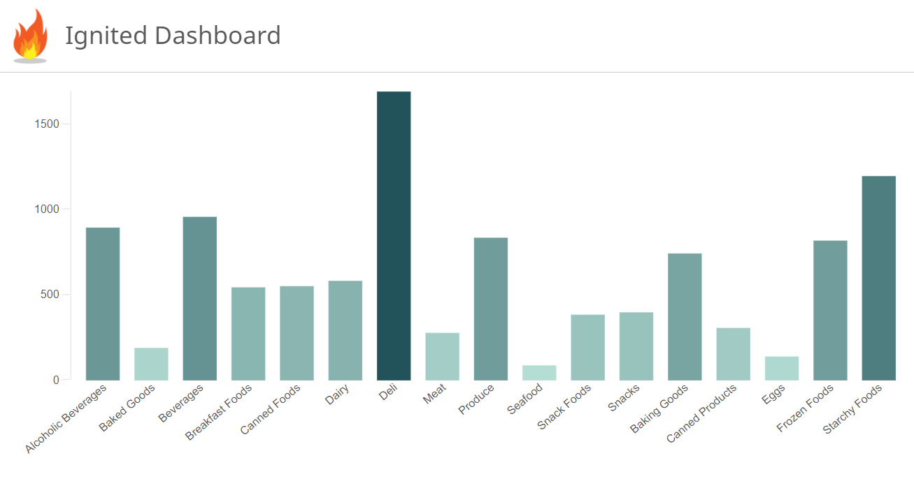

Qlik mashup boilerplate with <a href="https://github.com/facebook/react">ReactJS</a>, <a href="https://github.com/qlik-oss/leonardo-ui=">Leonardo UI</a>, <a href="https://github.com/qlik-oss/enigma.js/">Enigma.js</a> and <a href="https://github.com/qlik-oss/picasso.js">Picasso.js</a>

---

## Features
* **Create a mashup faster than fire**: just clone/download the repo, do a `npm install`, add your Qlik connection in the `index.js` file and start building your dashboard.
* **Do it your way**: You can use all the packages, or just remove those you don't need.
* **Easy to scale**: Use ReactJS components to modularize your UI and make it more developer-friendly.
* **Full customizable**: You can edit everything, from the general UI to the data retrieved by Enigma.js

## How does it work?
By default, the app uses Enigma.js to create custom hypercubes and retrieve the data from the Qlik Engine. This data is passed through component props to Picasso.js, where the charts are created on the fly.

The general User Interface is stylized with the Qlik style using Leonardo-UI. Everything is articulated using components from ReactJS.

## How to use
```
1.) git clone https://github.com/JoseHervas/igniter your-project-folder
2.) cd your-project-folder
3.) Edit the EnigmaJS config on the index.js file, or just open Qlik Desktop.
4.) npm install && npm start
```



You can navigate to http://localhost:3000/ and see your dashboard. Remember to run `npm run build` if you are ready to deploy your mashup.

## Next

* Automated testing for the app
* Redux for storing components' states.
* Store EnigmaJS & PicassoJS configuration data on external files.
* SCSS or SASS to parameterize theme styles.

## License and attributions
Leonardo UI, Enigma.js, Picasso.js are developed and mantained by QlikTech International AB. All of them with a MIT license.

ReactJS is developed and mantained by Facebook. Also with a MIT license.

All the credits corresponding to these frameworks' features correspond, therefore, to their developers.

The demo page takes the styles from the <a href="https://qlik-oss.github.io/leonardo-ui/">Leonardo-UI's demo page</a>. The fire logo is created by <a href="https://www.freepik.com/free-photos-vectors/abstract">Freepik</a>.

This project also goes with a <a href="LICENSE"> MIT license</a>.

## Have fun
A Pull Request or a Star to this repo will make my day :)
